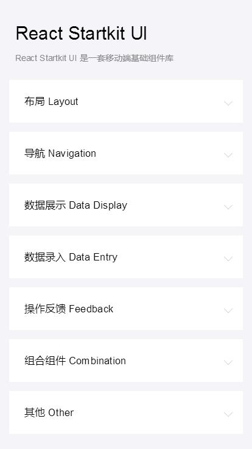

# react-startkit-ui

React Startkit UI 是一套移动端基础组件库，参考 Ant Design Mobile。项目预览[点击此预览](https://sufangyu.github.io/project/react-startkit-ui/index.html)
 


### 截图




### 安装与使用

``` bash
# 安装依赖
npm install

# 开发
npm run dev

# 打包发布
npm run build

# 测试
npm test